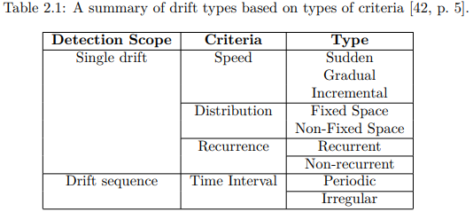
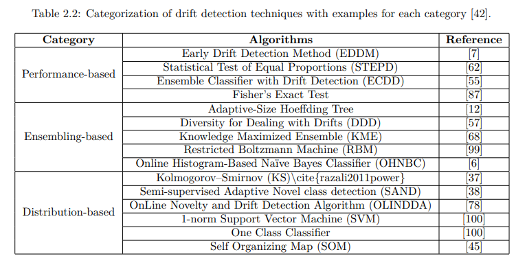

Data drift Detections : 
- berdasarkan distribusi data, untuk menghilangkan proses pre-processing bisa gunakan deep learning
-  According to Barddal et al., feature
    selection could be either manually done by experts as in the Very Fast Decision Tree (VFDT), Facil, and
    Very Fast Decision Rules (VFDR) for data classification, or implicitly implemented by the learning model
    as in Concept-adapting Very Fast Decision Tree (CVFDT), Heterogeneous Ensemble for Data Stream
    (HEFT-Stream), and Hoeffding Adaptive Tree (HAT) for data classification. These algorithms for feature
    selection were experimented in order to evaluate their ability to implicitly overcome drifts. Hence, there
    were no explicit definitions of feature drift detection tasks embedded within them nor there was an explicit
    metric to measure drifts

classical machine learning drift detection

deep learning drif detections 

- which algorithm 
    Following the proposed solutions by Rabanser et al. [66], the Kernel-based Maximum Mean Discrepancy
    and the Kolmogorov-Smirnov are selected for comparative analysis and evaluation on drift detection.
    Both algorithms have been shown to be able to detect drifts for high-dimensional features which enables
    to test them on different drift scenarios as to be shown in Section 3.8.2. Furthermore, implementing
    statistical hypothesis testing as in Figure 2.8 enables to provide justifiable answers. Namely, how the
    drift is detected. In addition, statistical hypothesis testing enables to test whether the test data and
    the reference data are independent and identically distributed (i.i.d) as usually assumed in training the
    desired model. Finally, the selected algorithms are to be run independently from the machine learning
    model in the pipeline which enables to analyze their performances separately from any model that can be
    used in the operational pipeline.